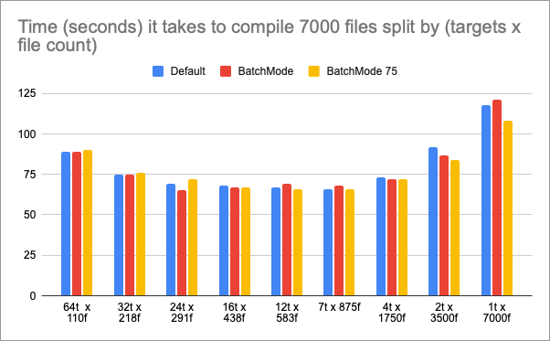

# SwiftPM Compilation Benchmark (7000 Swift Files)

I put this repo together to answer a simple question: how much does Swift compile time change when you split the same amount of code across different numbers of targets?

Every benchmark shape keeps the total source count fixed at `7000` Swift files, pulled from `swift_tasks_7000/`. The only thing that changes is package layout.

## Benchmark Shapes

Generated under `Benchmarks/`:

1. `Project1_1Target_7000` (1 x 7000)
2. `Project2_2Targets_3500x2` (2 x 3500)
3. `Project3_4Targets_1750x4` (4 x 1750)
4. `Project4_8Targets_875x8` (8 x 875)
5. `Project5_16Targets_Approx438x16` (16 x ~438)
6. `Project6_32Targets_Approx218x32` (32 x ~218)
7. `Project7_64Targets_Approx110x64` (64 x ~110)
8. `Project8_12Targets_Approx583x12` (12 x ~583)
9. `Project9_24Targets_Approx291x24` (24 x ~291)

For multi-target cases, dependencies are chained target-to-target so a single `swift build` traverses the full graph.

## Scripts

- `setup_spm_benchmarks.sh`: creates or refreshes all benchmark projects from the shared source pool.
- `run_spm_benchmarks.sh`: runs clean + build per project, times compile duration, and prints a compact summary table.

## Quick Start

From repo root:

1. Confirm the source pool exists and has 7000 files.

```bash
find swift_tasks_7000 -maxdepth 1 -type f -name 'GeneratedTask*.swift' | wc -l
```

Expected: `7000`

2. Recreate benchmark projects.

```bash
rm -rf Benchmarks
./setup_spm_benchmarks.sh
```

3. Run the benchmark.

```bash
./run_spm_benchmarks.sh
```

## Useful Run Variants

Release build:

```bash
./run_spm_benchmarks.sh --configuration release
```

Batch mode:

```bash
./run_spm_benchmarks.sh --build-variant batch
./run_spm_benchmarks.sh --configuration release --build-variant batch
```

Batch mode with explicit size limit:

```bash
./run_spm_benchmarks.sh --build-variant batch-size-limit --batch-size-limit 75
./run_spm_benchmarks.sh --configuration release --build-variant batch-size-limit --batch-size-limit 100
```

Run only selected layouts (in the exact order you pass):

```bash
./run_spm_benchmarks.sh --targets 64,24,12,8
./run_spm_benchmarks.sh --targets 32 --configuration release
```

Allowed target values: `64,32,24,16,12,8,4,2,1`

## Output Notes

Per benchmark, the runner:

1. cleans (`swift package clean`)
2. builds (`swift build` + selected flags)
3. prints a short error excerpt if a build fails

The final summary includes per-project duration plus total measured compile time.

Duration format example: `02:37 (157s)`

Clean time is not included in measured compile time.

## Results

Latest benchmark chart:



## License

MIT, see [`LICENSE`](LICENSE).
